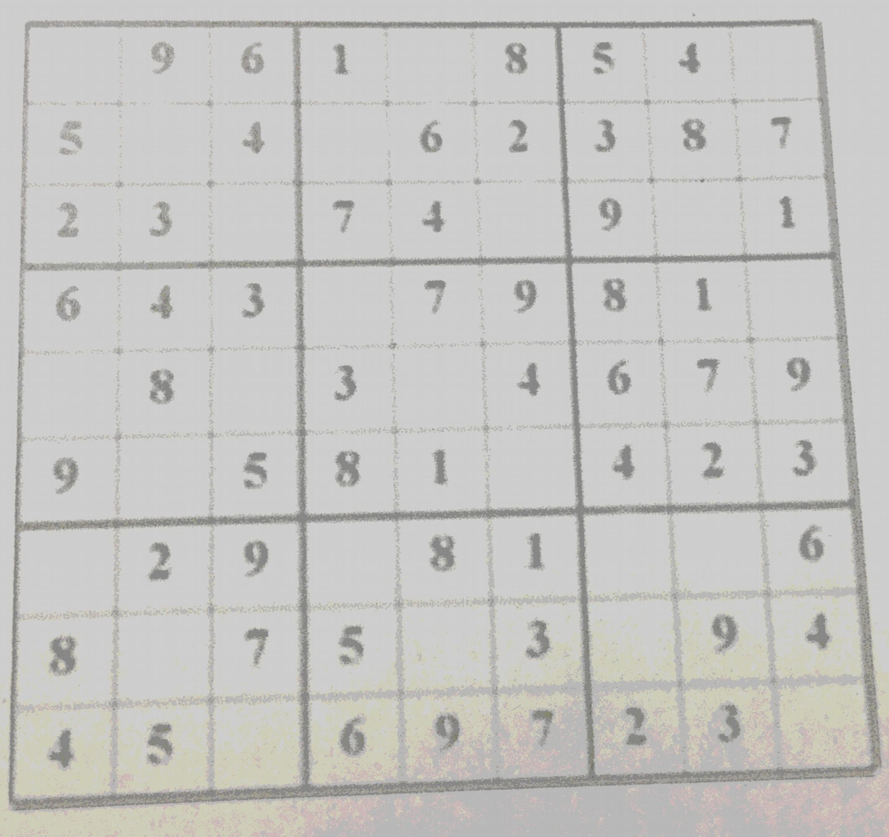
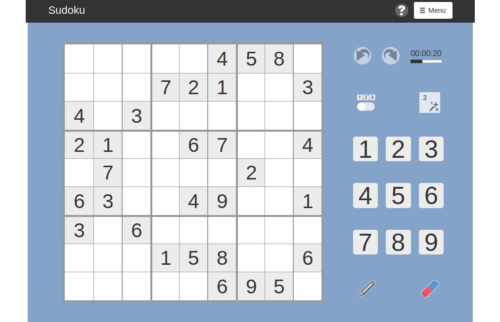
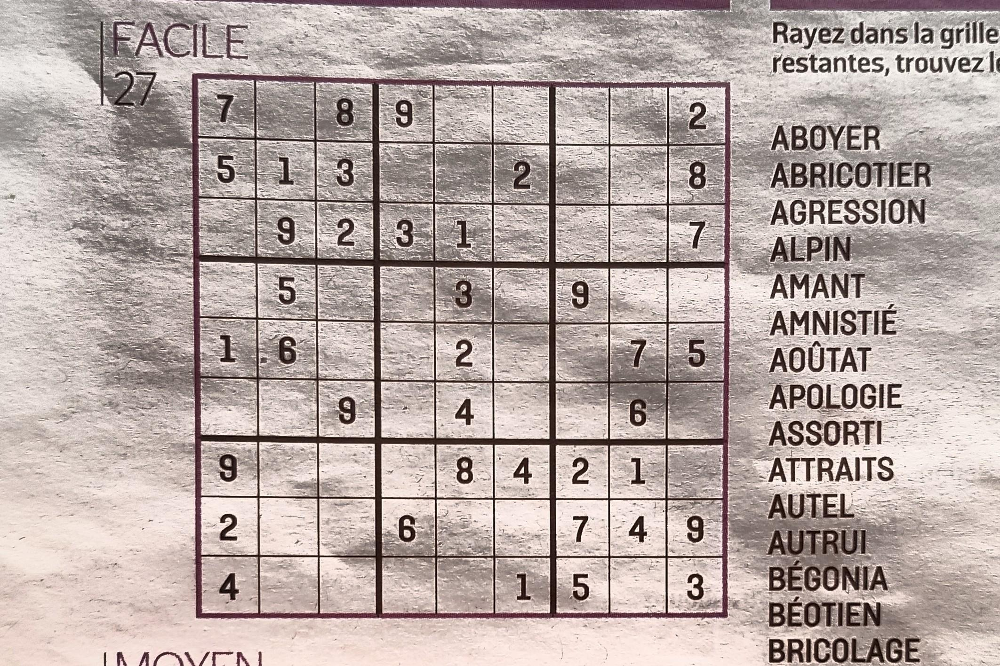

% Cnn Explanations

# Programming style

Even though the program is written in C we follow a object oriented style to
have a modular and more maintenable code.

## writing conventions

We use the convention that C struct are named in lower case. For instance:
```
struct img { /* ... */ };      // an image
struct imgfam { /* ... */ };   // a familly of images
struct foobar { /* ... */ };   // a random struct
```
It is followed by a definition with camel case notation to create a typedef:
```
typedef struct img Img;       // short for struct img 
typedef struct imgfam ImgFam; // short for struct imgfam
typedef struct foobar FooBar; // short for struct foobar
```

Another convention we use, is that we put everything related to ```struct foobar``` in
files ```foobar.h``` and ```foobar.c```, where foobar can be any name.

Another convention we use is that each function which deals with ```struct foobar```,
starts with a first argument which is a pointer to a ```struct foobar``` object and its name starts with ```fooBar```. That would be the equivalent
of the ```this``` pointer in C++ and NodeJs or ```self``` in Python. Here is an example in file ```foobar.c```:
```
int fooBarMyFunction(FooBar* fooBar) {
    /* do something great with fooBar
       similar to 'this' or 'self' */
    return 0;
}

```
In file ```foobar.h``` we find the prototype of the function:
```
int fooBarMyFunction(FooBar* fooBar);
```

## Documentation

We use doxygen to comment the code so that reports can be automatically generated. Here is an example:
```
/**
 * @brief A structure to store greyscale image data.
 */
struct img {
    /** number of horizontal pixels */
    int width;
    /** number of vertical pixels */
    int height;
    /** This is an allocated buffer of all pixels in the picture. 
     * Its size should be width times height.
     */
    unsigned char * data;
};
```

In order to redact this document we used ```pandoc``` which enables to use latex via a simple markdown document.

## Verication tools

We use the gnu autotools to generate makefiles, so that the code can be easily compiled with clang or gcc on different platforms. This enlarges the test coverage.

Compilers used are gcc and llvm.

Platforms to perform tests are intel and arm microprocessors.

To check memory usage we use Valgrind and Asan. Valgrind run tests directly on the binary. Asan requires the flags
```
-fsanitize=address  -fsanitize=undefined
```
at the compilation phase. Sanitizers slow down the code, so they are not always used.


# Global architecture

## Functionnal architecture

We split the functions to perform according to the following tasks:

- detect the sudoku grid in the picture.

   - Input of this module : a picture.
   - Output of this module : a square in the original picture which holds the sudoku grid. If no grid is found the image is rotated.

- extract all sudoku cells from the picture. 
   - Input of this module : an almost square picture holding only the sudoku grid
   - Output of this module : 81 small pictures which represent each cell of the sudoku grid.

- recognize all digits and empty cells.
   
   - Input of this module : a picture which represents a sudoku cell
   - Output of this module : a mumber between 0 and 9 representing a digit between 1 to 9 or an empty cell.

## Software achitecture

The main function and the invocation of phases is done in the CNN module.
It is present in files ```cnn.h``` and ```cnn.c```.

The parts related to the detection of the grid are in the GRID module.
It is present in files ```grid.h``` and ```grid.c```.

The parts related to the detection of digits are in the DIGIT module.
It is present in files ```digit.h``` and ```digit.c```.

We need primitives to manipulate image, this is done in the IMG module. They are in files ```img.h``` and ```img.c```. Groups (aka famillies) of images are handles in  ```imgfam.h``` and ```imgfam.c```.

Images which are used as filters are used in files ```filter.h``` and ```filter.c```. Groups (aka famillies) of filters are handles in  ```filterfam.h``` and ```filterfam.c```.

Generic functions used in all the code are present in files ```util.h``` and ```util.c```.


# IMG: primitives on images

## Storing images

We store greyscale images. We use a pointer to a data structure ```Img```:
```
/**
 * @brief A structure to store greyscale image data.
 */
struct img {
    /** number of horizontal pixels */
    int width;
    /** number of vertical pixels */
    int height;
    /** This is an allocated buffer of all pixels in the picture. 
     * Its size should be width times height.
     */
    unsigned char * data;
};
```
We use the equivalent of a constructor with the function ```newImgColor```:
```
/**
 * @brief create an image of a given color
 * @param w width of the picture
 * @param h height of the picture 
 * @param c hey level to fill the picture with
 * @return a newly allocated image.
 */
Img * newImgColor(int w, int h, unsigned char c) {
    Img * answer = (Img *)malloc(sizeof(struct img));
    answer->width=w;
    answer->height=h;
    answer->data=
        (unsigned char*)malloc(answer->height * answer->width);
    memset(answer->data,c,answer->height * answer->width);
    return answer;
}
```

Then we have the equivalent of the destructor to free the allocated memory:
```
/**
 * @brief Deletes an existing image.
 * @param myImg an existing image to delete
 *        Nothing happens if myImg is NULL.
 */
void deleteImg(Img*myImg) {
    if (myImg==NULL) return;
    free(myImg->data);
    myImg->width=0;
    myImg->height=0;
    myImg->data=NULL;
    free(myImg);
}
```


## Inversing grayscale  {#invert}

To invert a picture we use the code below:
```

/**
 * @brief Inverts an image.
 * @param in the input image to invert.
 * @return a newly allocated image which is the invese of image in.
 */
Img* imgInvert(Img*in) {
    Img * answer = newImgCopy(in);
    for(int i = 0; i < in->height*in->width; i++) {
        answer->data[i]=255-in->data[i];
    }
    return answer;
}
```

## Luminosity  {#luminosity}

To make sure we have the right level of contast we make sure the picture has enought dark and bright pixel.

Here is the algorithm we use:

- we compute the number of pixels with a luminosity 255, the number of pixels with a luminosity 254 and so on.
We denote ```lumCount[i]``` the number of pixels with luminosity ```i```.

On average ```lumCount[i]``` should be ```height*width/256```. We are going to take the brightest pixel
where ```lumCount[i]>height*width/256/8```, set its luminosity to 255. We do the same with dark pixels:
the darker pixel where  ```lumCount[i]>height*width/256/8``` is set to a luminosity of 0.

```
/**
 * @brief Spread luminosity in the picture.
 * @param in the picture to spread luminosity
 * @return the newly allocated picture with spreaded luminosity.
 */
Img* imgLuminosityScale(Img*in) {
    int lumCount[256];
    memset(lumCount,0,sizeof(int)<<8);
    Img * answer = newImgCopy(in);
    for(int i = 0; i < in->height*in->width; i++) {
        lumCount[in->data[i]]++;
    }
    // average value is a celle of lumCount should
    // be avg=(in->height*in->width/256
    // we are going to suppress below and above avg/8
    int threshold=(in->height*in->width)>>12; // divide by 256*8
    if (threshold<2) threshold=2;
    int topLum=255;
    while (topLum>0 && lumCount[topLum]<threshold) --topLum;
    int botLum=0;
    while (botLum<topLum && lumCount[botLum]<threshold) ++botLum;
    //topLum=100;
    for(int i = 0; i < in->height*in->width; i++) {
        answer->data[i]=
            (in->data[i]-botLum)*255/(topLum-botLum);
    }
    return answer;
}
```

## Rotate an image  {#rotate}
To rotate an image without changing its size here is the algorithm we use:

- we take a pixel in the new image.

- using floats we compute its position before the rotation.

- if its position is very close to an existing pixel, (0.0001 pixel close) we take the color of this pixel.

- else we compute the weighted average with the 4 surrounding pixels.

This algorithm is described in http://www.leptonica.org/rotation.html
```
/**
 * @brief Rotates an image
 * @param img to rotate
 * @param deg degrees to rotate
 * @return the down sampled image.
 * @see http://www.leptonica.org/rotation.html
 */
Img* imgRotate(Img* img,int deg) {
    Img * answer = newImgColor(img->width,img->height,255);
    float rad=deg*3.14159/180;
    float c = cos(rad);
    float s = sin(rad);
    int w=img->width;
    int h=img->height;
    float eps=0.0001;    // epsilum, considered as zero   
    for (int x=0;x<w;++x) {
        for (int y=0;y<h;++y) {
            double xd= (x-w/2)*c - (y-h/2)*s + w/2;
            double yd= (x-w/2)*s + (y-h/2)*c + h/2;
            if (xd>0 && yd>0 && xd<w-1 && yd<h-1) {
                double xf=floor(xd);
                double xc=ceil(xd);
                double yf=floor(yd);
                double yc=ceil(yd);
                double ff=sqrt((xd-xf)*(xd-xf)+(yd-yf)*(yd-yf));
                double fc=sqrt((xd-xf)*(xd-xf)+(yd-yc)*(yd-yc));
                double cf=sqrt((xd-xc)*(xd-xc)+(yd-yf)*(yd-yf));
                double cc=sqrt((xd-xc)*(xd-xc)+(yd-yc)*(yd-yc));
                int v=255;
                if (-eps<ff && ff<eps) {
                    v=img->data[(int)(xf+w*yf)];
                } else if (-eps<fc && fc<eps) {
                    v=img->data[(int)(xf+w*yc)];
                } else if (-eps<cf && cf<eps) {
                    v=img->data[(int)(xc+w*yf)];
                } else if (-eps<cc && cc<eps) {
                    v=img->data[(int)(xc+w*yc)];
                } else {
                    // not too close to any point, so compute average
                    double t=1/ff+1/fc+1/cf+1/cc;
                    v=(int)((img->data[(int)(xf+w*yf)]/ff+
                             img->data[(int)(xf+w*yc)]/fc+
                             img->data[(int)(xc+w*yf)]/cf+
                             img->data[(int)(xc+w*yc)]/cc)/t);
                }
                answer->data[x+w*y]=v;
            }
        }
    }
    return answer;
}
```

# GRID: detecting the sudoku grid

This section details how to locate the sudoku grid in the picture

## Preprocessing

Before running any filter on the image we perform some manipulation.

- the image is reduced in size so that both width and height are both below 400 pixels.

- the luminosity of the picture is streched, so that a good contact is present. This uses the algorith, described in section \ref{luminosity}.

- then colors are inverted (white becomes black and black becomes white). This uses the function shown in section \ref{invert}.


+-----------------------------------------------------------+-----------------------------------------------------------+-----------------------------------------------------------+
|{width=80px}            |{width=80px}            |{width=80px}            |
+-----------------------------------------------------------+-----------------------------------------------------------+-----------------------------------------------------------+
|step 1                                                     |step 2                                                     |step 3                                                   |
+-----------------------------------------------------------+-----------------------------------------------------------+-----------------------------------------------------------+
|scaled image                                               |luminosity                                                 |inverted                                                   |
+-----------------------------------------------------------+-----------------------------------------------------------+-----------------------------------------------------------+

## First filter

Let us consider the following picture:

{width=80px}

To start with we take a set of diffenrent convolution filters with an horizon line of length l ranging from 200 to 10. Here are the results:


+-----------------------------------------------------------+-----------------------------------------------------------+-----------------------------------------------------------+-----------------------------------------------------------+-----------------------------------------------------------+
|{width=80px} |{width=80px} |{width=80px} |{width=80px} |{width=80px} |
|l=200                                                      |l=190                                                      |l=180                                                      |l=170                                                      |l=160                                                      |
|{width=80px} |{width=80px} |{width=80px} |{width=80px} |{width=80px} |
|l=150                                                      |l=140                                                      |l=130                                                      |l=120                                                      |l=110                                                      |
|{width=80px} |{width=80px} |{width=80px} |{width=80px} |{width=80px} |
|l=100                                                      |l=90                                                       |l=80                                                       |l=70                                                       |l=60                                                       |
|{width=80px} |{width=80px} |{width=80px} |{width=80px} |{width=80px} |
|l=50                                                       |l=40                                                       |l=30                                                       |l=20                                                       |l=10                                                       |
+-----------------------------------------------------------+-----------------------------------------------------------+-----------------------------------------------------------+-----------------------------------------------------------+-----------------------------------------------------------+

The shorter the length of the line the less selective we are. There is an issue.
We can see that line in the bottom of the picture are not well taken into account because the are not exactly horizontal. So we add the following convolution filters where the lines rotate between $-5^o$ and $5^o$: 

+--------------------------------------+--------------------------------------+--------------------------------------+--------------------------------------+--------------------------------------+
||||||
+--------------------------------------+--------------------------------------+--------------------------------------+--------------------------------------+--------------------------------------+
|$1^o$                                 |$2^o$                                 |$3^o$                                 |$4^o$                                 |$5^o$                                 |
+--------------------------------------+--------------------------------------+--------------------------------------+--------------------------------------+--------------------------------------+
||||||
+--------------------------------------+--------------------------------------+--------------------------------------+--------------------------------------+--------------------------------------+
|$-1^o$                                |$-2^o$                                |$-3^o$                                |$-4^o$                                |$-5^o$                                |
+--------------------------------------+--------------------------------------+--------------------------------------+--------------------------------------+--------------------------------------+

Those filters with a line of length 100 and thickness of 1 are easily generated with the following command lines:
```
img --vertical 100 1 --rotate 85 --inverse out.png
img --vertical 100 1 --rotate 86 --inverse out.png
img --vertical 100 1 --rotate 87 --inverse out.png
img --vertical 100 1 --rotate 88 --inverse out.png
img --vertical 100 1 --rotate 89 --inverse out.png

img --vertical 100 1 --rotate 91 --inverse out.png
img --vertical 100 1 --rotate 92 --inverse out.png
img --vertical 100 1 --rotate 93 --inverse out.png
img --vertical 100 1 --rotate 94 --inverse out.png
img --vertical 100 1 --rotate 95 --inverse out.png

```
The same thing can be acheived programmatically by calling functions:
```
Img * newImgVerticalBar(int s,int w);
Img * imgRotate(Img* img,int deg);
Img * imgInvert(Img*in);
```


+-----------------------------------------------------------+-----------------------------------------------------------+-----------------------------------------------------------+-----------------------------------------------------------+-----------------------------------------------------------+
|{width=80px}    |{width=80px}    |{width=80px}    |{width=80px}    |{width=80px}    |
|l=200                                                      |l=190                                                      |l=180                                                      |l=170                                                      |l=160                                                      |
|{width=80px}    |{width=80px}    |{width=80px}    |{width=80px}    |{width=80px}    |
|l=150                                                      |l=140                                                      |l=130                                                      |l=120                                                      |l=110                                                      |
|{width=80px}    |{width=80px}    |{width=80px}    |{width=80px}    |{width=80px}    |
|l=100                                                      |l=90                                                       |l=80                                                       |l=70                                                       |l=60                                                       |
|{width=80px}    |{width=80px}    |{width=80px}    |{width=80px}    |{width=80px}    |
|l=50                                                       |l=40                                                       |l=30                                                       |l=20                                                       |l=10                                                       |
+-----------------------------------------------------------+-----------------------------------------------------------+-----------------------------------------------------------+-----------------------------------------------------------+-----------------------------------------------------------+


Let us consider the following picture:

{width=80px}

The set of diffenrent convolution filters for l ranging from 200 to 10 is:

+-----------------------------------------------------------+-----------------------------------------------------------+-----------------------------------------------------------+-----------------------------------------------------------+-----------------------------------------------------------+
|{width=80px}|{width=80px}|{width=80px}|{width=80px}|{width=80px}|
|l=200                                                      |l=190                                                      |l=180                                                      |l=170                                                      |l=160                                                      |
|{width=80px}|{width=80px}|{width=80px}|{width=80px}|{width=80px}|
|l=150                                                      |l=140                                                      |l=130                                                      |l=120                                                      |l=110                                                      |
|{width=80px}|{width=80px}|{width=80px}|{width=80px}|{width=80px}|
|l=100                                                      |l=90                                                       |l=80                                                       |l=70                                                       |l=60                                                       |
|{width=80px}|{width=80px}|{width=80px}|{width=80px}|{width=80px}|
|l=50                                                       |l=40                                                       |l=30                                                       |l=20                                                       |l=10                                                       |
+-----------------------------------------------------------+-----------------------------------------------------------+-----------------------------------------------------------+-----------------------------------------------------------+-----------------------------------------------------------+

Let us consider the following picture:

{width=80px}

The set of diffenrent convolution filters for l ranging from 200 to 10 is:

+-----------------------------------------------------------+-----------------------------------------------------------+-----------------------------------------------------------+-----------------------------------------------------------+-----------------------------------------------------------+
|{width=80px}|{width=80px}|{width=80px}|{width=80px}|{width=80px}|
|l=200                                                      |l=190                                                      |l=180                                                      |l=170                                                      |l=160                                                      |
|{width=80px}|{width=80px}|{width=80px}|{width=80px}|{width=80px}|
|l=150                                                      |l=140                                                      |l=130                                                      |l=120                                                      |l=110                                                      |
|{width=80px}|{width=80px}|{width=80px}|{width=80px}|{width=80px}|
|l=100                                                      |l=90                                                       |l=80                                                       |l=70                                                       |l=60                                                       |
|{width=80px}|{width=80px}|{width=80px}|{width=80px}|{width=80px}|
|l=50                                                       |l=40                                                       |l=30                                                       |l=20                                                       |l=10                                                       |
+-----------------------------------------------------------+-----------------------------------------------------------+-----------------------------------------------------------+-----------------------------------------------------------+-----------------------------------------------------------+


# Looking at the digits

We use a convolution neural network.

## Layer 1 filters

Layer 1 patterns is made of 6, 5 by 5 pixel images as chown below.

Layer 1 patterns
------------------  ------------------  -------------------
    
layer_1_0           layer_1_1           layer_1_2
    
layer_1_3           layer_1_4           layer_1_5

They are made of a white rectangle rotating of $30^o$ with a black pixel
in the middle.

Each of these png images are generated by the bash script ```gen_patterns.sh```.

The familly of 6 pictures forming the level 1 filters can be acccessed via the pointer of an instance of ```ImgFam``` as given by the c function ```getLayer1``` in file ```imgfam.c```.


## Applying layer 1 filters

Layer 1 filers are applied using:
- convolution filters to identify orientation of lines.
- max pool to reduce size

Here are some example of output of layer 1 for a cross and a circle.


+---------------------+------------------------------+------------------------------+------------------------------+------------------------------+------------------------------+------------------------------+
| Base image 28x28    | Conv. with layer_1_0         | Conv. with layer_1_1         | Conv. with layer_1_2         | Conv. with layer_1_3         | Conv. with layer_1_4         | Conv. with layer_1_5         |
+=====================+==============================+==============================+==============================+==============================+==============================+==============================+
| | | | | | | |
+---------------------+------------------------------+------------------------------+------------------------------+------------------------------+------------------------------+------------------------------+
| | | | | | | |
+---------------------+------------------------------+------------------------------+------------------------------+------------------------------+------------------------------+------------------------------+

The input image size is 28x28. Layer 1 output size is 24x24. 