% Cnn Explanations

# Programming style

Even though the program is written in C we follow a object oriented style to
have a modular and more maintenable code.

## writint conventions

We use the convention that C struct are named in lower case. For instance:
```
struct img { /* ... */ };      // an image
struct imgfam { /* ... */ };   // a familly of images
struct foobar { /* ... */ };   // a random struct
```
It is followed by a definition with camel case notation to create a typedef:
```
typedef struct img Img;       // short for struct img 
typedef struct imgfam ImgFam; // short for struct imgfam
typedef struct foobar FooBar; // short for struct foobar
```

Another convention we use, is that we put everything related to ```struct foobar``` in
files ```foobar.h``` and ```foobar.c```, where foobar can be any name.

Another convention we use is that each function which deals with ```struct foobar```,
starts with a first argument which is a pointer to a ```struct foobar``` object and its name starts with ```fooBar```. That would be the equivalent
of the ```this``` pointer in C++ and NodeJs or ```self``` in Python. Here is an example in file ```foobar.c```:
```
int fooBarMyFunction(FooBar* fooBar) {
    /* do something great with fooBar
       similar to 'this' or 'self' */
    return 0;
}

```
In file ```foobar.h``` we find the prototype of the function:
```
int fooBarMyFunction(FooBar* fooBar);
```

## Documentation

We use doxygen to comment the code so that reports can be automatically generated. Here is an example:
```
/**
 * @brief A structure to store greyscale image data.
 */
struct img {
    /** number of horizontal pixels */
    int width;
    /** number of vertical pixels */
    int height;
    /** This is an allocated buffer of all pixels in the picture. 
     * Its size should be width times height.
     */
    unsigned char * data;
};
```

## Verication tools

We use the gnu autotools to generate makefiles, so that the code can be easily compiled with clang or gcc on different platforms. This enlarges the test coverage.

Compilers used are gcc and llvm.

Platforms to perform tests are intel and arm microprocessors.

To check memory usage we use Valgrind and Asan. Valgrind run tests directly on the binary. Asan requires the flags
```
-fsanitize=address  -fsanitize=undefined
```
at the compilation phase.


# Looking at the grid


# Looking at the digits

We use a convolution neural network.

## Layer 1 filters

Layer 1 patterns is made of 6, 5 by 5 pixel images as chown below.

Layer 1 patterns
------------------  ------------------  -------------------
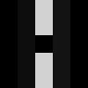  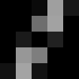  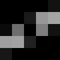
layer_1_0           layer_1_1           layer_1_2
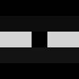  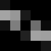  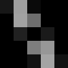
layer_1_3           layer_1_4           layer_1_5

They are made of a white rectangle rotating of $30^o$ with a black pixel
in the middle.

Each of these png images are generated by the bash script ```gen_patterns.sh```.

The familly of 6 pictures forming the level 1 filters can be acccessed via the pointer of an instance of ```ImgFam``` as given by the c function ```getLayer1``` in file ```imgfam.c```.


## Applying layer 1 filters

Layer 1 filers are applied using:
- convolution filters to identify orientation of lines.
- max pool to reduce size

Here are some example of output of layer 1 for a cross and a circle.


+---------------------+------------------------------+------------------------------+------------------------------+------------------------------+------------------------------+------------------------------+
| Base image 28x28    | Conv. with layer_1_0         | Conv. with layer_1_1         | Conv. with layer_1_2         | Conv. with layer_1_3         | Conv. with layer_1_4         | Conv. with layer_1_5         |
+=====================+==============================+==============================+==============================+==============================+==============================+==============================+
| 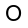| 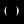| 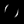| 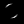| 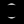| 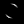| 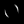|
+---------------------+------------------------------+------------------------------+------------------------------+------------------------------+------------------------------+------------------------------+
| 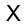| 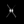| 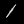| | 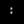| 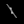| |
+---------------------+------------------------------+------------------------------+------------------------------+------------------------------+------------------------------+------------------------------+

The input image size is 28x28. Layer 1 output size is 24x24. 